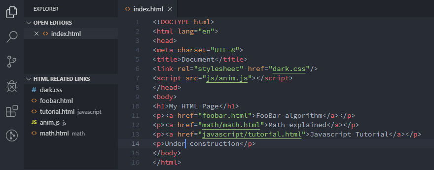

# HTML Related Links

Add a View of related and linked files of the current file to the Explorer container.



The files will be sorted based on there full path.

If you click on an entry in the view that file will be opened. If the file does not exist nothing happens.

The tags handled for HTML files are: `a`, `img`, `link`, `script`.

## Lock view to a file

Sometimes you want to fix the view to the content of a particular file. You can do this with the **`Lock to file`** button  in the title bar of the view.

## Configuration

You can add regular expressions to find more related files or exclude files found.

The configuration options can be found in the `Extensions` | `HTML Related Links` section of the Settings UI.

If the configuration option is an arrays of strings it can be modified in the Settings UI and in the `settings.json` file.

Because the `settings.json` files for the User, Workspace and folder are merged you might need to set certain configuration options to the empty array in certain `settings.json` files.

Be aware of the additional escaping needed if you edit `settings.json`.

## `html-related-links.include`

Because `html-related-links.include` can be an array or an object it can only be modified in `settings.json`.

The extension defines a find for HTML tags with links and adds this to the list with languageId `html`. In a previous version it was applied to any file. I don't think there is a use for it in non HTML files.

### `include` is an array

If it is an array the elements are strings that are regular expressions that are used to **find related files in any file**. The first capturing group is used as the related file. These strings are added to the list of strings for the special languageId: `all` (see next paragraph).

### `include` is an object

If it is an object you group the array of regular expressions to use by [languageId of the file](https://code.visualstudio.com/docs/languages/overview#_language-id). You can use any known VSC languageId and the special languageId `all`. 

The `all` list of regex strings is mainly used to emulate the behaviour when this configuration option was only an array of strings. The `all` list is used for any file.

The elements of the array are objects with 1 or 2 properties (or strings, see next paragraph):
* `find` : a regex string with capture groups. property is required
* `filePath` : a string that constructs the file path using the captured groups from `find`.
    * it is a string as you would use in a regex replace operation, use `$1`, `$2`, ... to reference captured groups.
    * the default value is: `"$1"`
    * if the file path is relative to the file root directory you must start the `filePath` string with `/`.<br/>Example: if the `find` captures a relative to the file root Javascript file without extension use: `"/$1.js"`
* `lineNr` : a string that constructs the line number to jump to using the captured groups from `find`.<br/>Example: `"find": "([\\w.]+)@(\\d+)", "lineNr": "$2"`
* `charPos` : a string that constructs the character position to jump to using the captured groups from `find`. Only used when `lineNr` is defined.

If you use the default value for `filePath` you can replace the object by the `find` property string. The following 3 elements are equivalent:
```
{ "find": "require\\('([^']+)'\\);", "filePath": "$1" },
{ "find": "require\\('([^']+)'\\);" },
"require\\('([^']+)'\\);"
```

### Example 1

You want to find files referenced in PHP `require` statements. You add the following 2 regular expressions in `settings.json` :

```
  "html-related-links.include": {
    "php": [
      "require\\('([^']+)'\\);",
      "require '([^']+)';"
    ]
  }
```

At the moment it is not possible to limit the search to particular parts of the file. So if you write pages about PHP and use the `require` in your examples these files will also be matched. For HTML links in examples this does not apply because the `<` is written as `&lt;`, so it will not be matched as a HTML tag. It can lead to a match in Javascript files that construct HTML text.

### Example 2

If you also have a number of JavaScript files that use `import` statements and some of the file paths are relative paths you can add this to your `settings.json` :

```
  "html-related-links.include": {
    "php": [
      "require\\('([^']+)'\\);",
      "require '([^']+)';"
    ],
    "javascript": [
      { "find": "import [^ ]+ from '((?=src/).+?)';", "filePath": "/$1.js" },
      { "find": "import [^ ]+ from '((?!src/).+?)';", "filePath": "$1.js" }
    ]
  }
```

The first `javascript` find is for files in the `src` directory relative to the [file root](#html-related-links.fileroot). The second find is for files relative to the current file.

## `html-related-links.exclude`

Is an array of strings that are regular expressions that are used to **match in the full file path**. The relative files found with the `include` regular expressions are converted to full file paths that are used to open the file. If any of the regular expressions in the `exclude` option has a match on the full file path that file will be excluded from the view.

Because different file systems use different directory separators you have to take that into account if you need to use it on multiple systems or share with team members.

### Example 1

You want to exclude all files that are in the `foo` subdirectory.

Add the following regular expression in the Settings UI:

* `[\\/]foo[\\/]`

or

* `([\\/])foo\1`

In `settings.json` it will look like

```
  "html-related-links.exclude": [
    "[\\\\/]foo[\\\\/]"
  ]
```

or

```
  "html-related-links.exclude": [
    "([\\\\/])foo\\1"
  ]
```

### Example 2

You want to exclude all files where the file name contains `bar`.

Add the following regular expression in the Settings UI:

* `([\\/])(?=[^\\/]+$).*bar`

In `settings.json` it will look like

```
  "html-related-links.exclude": [
    "([\\\\/])(?=[^\\\\/]+$).*bar"
  ]
```

(The first capture group `()` is needed here because VSC tries to find Markdown URLs (`[]` followed by `()`) inside code. It can be removed if you enter it in the configuration option.)

We look for the last directory separator. Find a directory separator that is followed by a string that does not contain a directory separator. And then for a string that has `bar` anywhere in it.

## `html-related-links.fileroot`

Is an array of strings that are the relative root directories of the websites in the workspace folder.

These strings are joined with the workspace folder to get the full website root folders.

The website root folder is used for files that have a path that starts with `/` (not `//` for external link with same protocol). Used for linking style, script, .... files.

Which folder is choosen as the website root folder is done with the following steps:

1. rootfolder = current file folder
1. If there is a workspace folder: rootfolder = workspace folder
1. If a join of the workspace folder and an element of `fileroot` is the start of the current file path: rootfolder =  this join

If you have the following directory structure

```
/home/myname/WebProjects
             ├── .vscode
             │   └── settings.json
             ├── work
             │   └── siteFoo
             │       └── <website files>
             └── siteBar
                 └── <website files>
```

and you have opened `/home/myname/WebProjects` as a folder or part of a Multi Root Workspace you add this setting to the file `/home/myname/WebProjects/.vscode/settings.json`:

```
  "html-related-links.fileroot": [
    "work/siteFoo",
    "siteBar"
  ]
```

You can use the Settings GUI to modify this setting for any folder of the (MR) Workspace.

This setting does not make sence to use in the global user setting.

## `html-related-links.alwaysShow`

This boolean is used to determine if the HTML Related Links view is visible if the languageId of the file is not HTML. Default value is `false`. This means that the view is only visible when the current file has the languageId `'html'`.
If you use the extension for other languageIds set the value to `true`.

If you use a Multi Root Workspace you have to change it in the User settings or the Workspace setting. If defined in a Folder it does not work (VSC v1.44.2)

## `html-related-links.sortByPosition`

Default the links in the view are sorted by the file path. If enabled the links are in the order found in the file. If a link is found multiple times the first position is used.

## TODO
* add the possibility to create a file that does not exist
